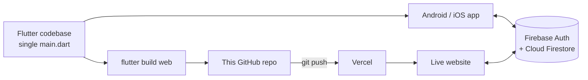

# Sumitra HP Gas – Agency Management System (Web)

A real-time management system for an HP Gas distributorship, built with **Flutter** and **Firebase**. It runs as a mobile app and as this website, both built from a single shared codebase, so the agency's staff can manage stock, customers, staff and complaints from a phone or any browser.

**Live website:** https://sumitragasagency.vercel.app

> This repository contains the production web build that is deployed to Vercel. The application source code (Flutter/Dart) is maintained in a separate repository.

---

## The problem

A gas agency handles several kinds of stock every day: 14 kg, 19 kg and 5 kg cylinders (filled, empty, damaged and undelivered), plus stoves, aprons and lighters. Tracking all of this in notebooks made it easy to lose count, hard to know who changed what, and slow to follow up on customer complaints.

This app replaces that with one shared, live system that every staff member sees in real time.

---

## Features

**Dashboard**
- Live overview of current stock levels
- Upcoming stock card showing ordered quantities that haven't arrived yet

**Inventory**
- Cylinder stock by size (14 kg / 19 kg / 5 kg), split into filled, empty, damaged and undelivered
- Product stock for stoves, aprons and lighters (stock left, issued, damaged, incoming)
- Stock arrival history, sorted by date
- **Stock receive confirmation:** when a scheduled delivery date arrives, staff confirm the quantity actually received, and only that quantity is added to inventory

**Audit trail**
- Every inventory change is logged with who made it, when, and exactly what changed
- The staff member's name is resolved from their staff profile, so the log shows real names instead of just emails

**Customers and staff**
- Add, edit and remove customers and staff members
- Staff roles and active/inactive status

**Complaints (Issues)**
- Log complaints by type (Cylinder or Stove)
- Grouped by priority (Urgent, Medium, Low) with an open/closed status

**Security**
- Firebase email and password login
- A second layer of security with a 4-digit app PIN, stored per user per device
- Face ID / fingerprint unlock on supported phones
- Change PIN and reset PIN flows

---

## Tech stack

| Layer | Technology |
|---|---|
| Frontend | Flutter (Dart), Material 3 |
| Authentication | Firebase Authentication (email/password) |
| Database | Cloud Firestore (real-time) |
| Mobile security | `flutter_secure_storage` (Keychain / Keystore), `local_auth` (biometrics) |
| Web storage | `shared_preferences` (browser storage) |
| Hosting | Vercel (static hosting, auto-deploy from GitHub) |
| Platforms | Android, iOS, Web |

---

## Architecture



Both the mobile app and the website talk to the same Firebase project, so a stock update made on a phone appears on the website instantly, and the other way round.

**Firestore collections**

| Collection | Purpose |
|---|---|
| `inventory` | Current cylinder and product stock, plus upcoming stock |
| `stockArrivals` | History of stock deliveries |
| `inventoryActivity` | Audit log of every stock change |
| `customers` | Customer records |
| `staff` | Staff records, roles and active status |
| `issues` | Customer complaints with type, priority and status |

---

## Key engineering decisions

**One codebase, three platforms.** The website was created without changing a single line of the mobile app. Platform differences are handled inside the code with Flutter's `kIsWeb` check, so the same file builds for Android, iOS and the browser.

**Graceful platform fallbacks.** Features that don't exist in a browser degrade safely instead of crashing:
- The PIN is stored in the phone's secure Keychain/Keystore on mobile, and in browser storage on the web.
- Biometric unlock is automatically hidden on the web. All biometric calls are wrapped in error handling, so an unsupported device simply shows "not available".

**Safe stock updates with transactions.** Receiving stock uses a Firestore transaction, so the arrival record and the inventory count are updated together. If two staff members act at the same moment, the numbers can't get out of sync.

**Accountability through an audit log.** Instead of only storing the latest numbers, every change writes a log entry with the user, a server timestamp and the before/after changes. This answers the question "who changed this stock and when?"

**Two-layer security.** Firebase login protects the account, and a device-level PIN (with optional biometrics) protects the app if a phone is left unlocked. The PIN key includes the user's ID, so different accounts on the same device keep separate PINs.

**Real-time UI.** Screens use Firestore streams (`StreamBuilder`), so every open device updates live without refreshing.

---

## Deployment pipeline

Vercel does not include Flutter, so the site is built locally and the finished static files are pushed to this repository. Vercel then serves them as-is (no build step).

```bash
# 1. Build the website from the Flutter project
flutter build web --release

# 2. Copy the build into this repository
rsync -a --delete --exclude .git --exclude README.md build/web/ ~/Sumitragasweb/

# 3. Push – Vercel deploys automatically
cd ~/Sumitragasweb
git add .
git commit -m "Update website"
git push
```

---

## Run locally

Requires Flutter and access to the source repository.

```bash
flutter pub get
flutter run -d chrome
```

---

## Screenshots

_Add screenshots here, for example:_

| Dashboard | Inventory | Complaints |
|---|---|---|
|  |  |  |

---

## What I'd improve next

- Role-based permissions (for example, only admins can delete staff or edit stock)
- Reports and charts for monthly stock movement
- Export data to Excel or PDF
- An automated build pipeline (GitHub Actions) so pushing source code builds and deploys the website automatically

---

## Author

**Tanishq Chauhan** · [GitHub](https://github.com/itanishq00)
